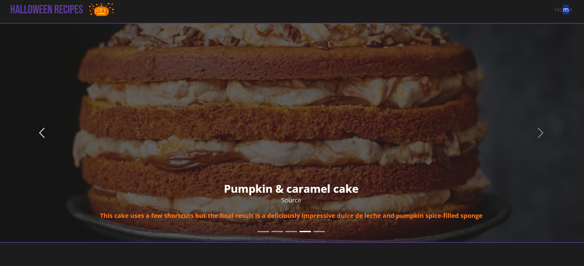

<h1 align="center">Halloween Recipes 🎃 🕸️🍭</h1>

<h2>Technologies ⚙️</h2>

Database💾 : PostGreSQL + Prisma

Backend🔌 : NodeJS + Fastify

Frontend🎨 : NextJS + React + Bootstrap + Tailwind CSS

  

<h2>Getting started</h2>

git clone

npm install

<h3>Backend</h3>

cd server

node app.js

<h3>Frontend</h3>

cd frontend

npm run dev

## 

Design inspired by Gordon Ramsay's recipes website : <a href="https://www.gordonramsay.com/">https://www.gordonramsay.com/</a>

